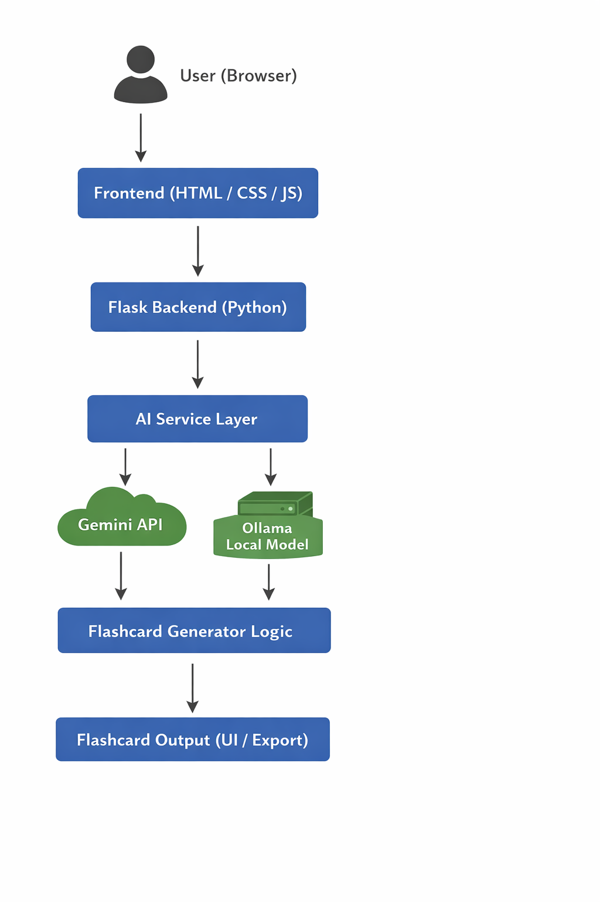

Vision Document
Project Name

FlashcardAI – AI Powered Flashcard Generator

Project Overview

FlashcardAI is a web application that automatically generates study flashcards from a topic using artificial intelligence. The system helps students quickly create study materials and practice quizzes without manually writing flashcards.

The application allows users to enter a topic, select the AI provider, choose the number of flashcards, and generate interactive flashcards instantly.

Problem It Solves

Students often spend significant time manually creating flashcards for studying. This process can be repetitive and inefficient.

FlashcardAI solves this problem by automatically generating flashcards using AI models, saving time and improving learning efficiency.

Target Users (Personas)

Student Sam

University student preparing for exams

Needs quick revision material

Uses flashcards for memorization

Teacher Tina

Instructor preparing learning materials

Needs quick study aids for students

Learner Leo

Self-learner studying new topics online

Wants structured learning resources quickly

Vision Statement

To create an intelligent learning assistant that automatically transforms topics into structured flashcards and quizzes to improve learning efficiency.

Key Features / Goals

AI-powered flashcard generation

Multiple flashcard styles (Q/A, definition, MCQ, true/false)

Support for multiple AI providers

Interactive flashcard interface

Quiz generation from flashcards

Export flashcards as CSV or PDF

Batch generation from topic files

Success Metrics

Number of flashcards generated per session

Number of users generating flashcards

Quiz completion rate

Export downloads (PDF / CSV)

Assumptions

Users have internet access

AI APIs remain available

AI models generate meaningful educational content

Constraints

AI API rate limits

Dependence on external AI services

Performance limitations of local AI models

MoSCoW Prioritization
Must Have

AI flashcard generation from topic

Topic input field

Flashcard display interface

Selection of AI provider

Flashcard question and answer structure

Should Have

Quiz generation from flashcards

CSV export functionality

PDF export functionality

Loading indicator while generating flashcards

Could Have

Batch topic generation from files

Dark mode UI

Copy flashcards to clipboard

Flashcard animations

Won't Have (for now)

User authentication

Cloud storage of flashcards

User analytics dashboard

Collaborative flashcard sharing

Branching Strategy

This project follows the GitHub Flow workflow.

Workflow:

The main branch contains the stable production code.

New features are developed in separate feature branches.

Feature branches are merged into main using Pull Requests.

Quick Start – Local Development
Prerequisites

Install the following tools:

Python 3.10+

Docker

Git

## System Architecture

The system follows a layered architecture where the frontend communicates with a Flask backend that interacts with AI services to generate flashcards.

